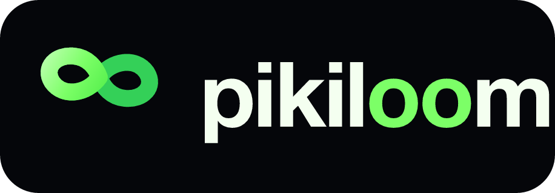

<div align="center">



## Put the world's smartest AI agents in your pocket.

##### *The open Agent orchestrator for the era when creators no longer need to read code.*

*Plug in any agent (Claude · Codex · Gemini · Hermes · …), any model (Claude · GPT · Gemini · DeepSeek · Doubao · MiMo · MiniMax · OpenRouter · or any third-party proxy), and any tool (Skills · MCP · CLI). Drive them seamlessly from your favorite terminal—whether it's an IM, Web Dashboard, or future interfaces. pikiloom is built using pikiloom.*

```bash
npx pikiloom@latest
```

<p>
<a href="https://www.npmjs.com/package/pikiloom"></a>
<a href="https://www.npmjs.com/package/pikiloom"></a>
<a href="https://github.com/xiaotonng/pikiloom/stargazers"></a>
<a href="LICENSE"></a>
<a href="https://nodejs.org"></a>
</p>

<p>
<b>English</b> | <a href="README.zh-CN.md">简体中文</a>
</p>


</div>

---

## What is pikiloom?

**Most "AI dev tools" settle for a narrow slice of the pie—binding you to a single IDE, a specific agent, or a closed model ecosystem.** pikiloom is built on a fundamentally different premise: the next era of software creation won't be confined to a single code editor. It happens within an **Orchestrator** that empowers a creator to drive a *swarm* of agents—in parallel, from one console—running on the best models available, through whichever terminal is closest at hand. And you might never need to open a code file.

The product is the orchestrator itself. Everything else simply plugs in. **And what's cooler is that this orchestrator is entirely self-bootstrapped**—pikiloom is what we use to build pikiloom.

The diagram above maps the four layers we stitch together:

- **Entry Points** — Telegram, Feishu, WeChat, Slack, Discord, DingTalk, WeCom, the Web Dashboard, and the local API/CLI are all first-class, co-equal terminals. New ones plug right in.
- **Pluggable Agents** — Claude Code, Codex, Gemini, and Hermes ship as built-in drivers. Hermes speaks ACP (Agent Client Protocol); the registry accepts any CLI- or ACP-based agent through the same `AgentDriver` contract.
- **Model Routing** — Frontier (Claude · GPT · Gemini), Chinese domestic (DeepSeek · Doubao · MiMo · MiniMax · Qwen), local runtimes (Ollama, mlx-lm on Apple Silicon), OpenRouter, and any OpenAI-compatible proxy. Providers + Profiles are a first-class vault with a read-only `models.dev` catalog and per-agent environment injection at spawn time.
- **Tool Mesh** — Skills, MCP servers, CLI tools, web search, and desktop automation, intelligently merged across global × workspace scopes and silently injected into every session.

Sitting in the middle is the **Pikiloom Orchestration Core** — the runtime that owns routing, memory, observability, and the bot lifecycle so any terminal can talk to any agent on any model through any tool.

---

## Built with Itself

> The most credible test of an Agent orchestrator is whether it can build itself. pikiloom can. We use pikiloom to develop, test, release, and operate pikiloom—driving every commit and every release.

A typical day of development inside pikiloom:

- A Claude Code session in pane 1 implements a new dashboard route.
- A Codex session in pane 2 writes the matching unit tests against the same workspace.
- A Gemini session in pane 3 reviews the diffs and drafts the changelog.
- Meanwhile, a background skill (`/sk_promote`) sweeps GitHub for relevant issues and automatically drafts replies in a fourth thread.
- All four streams run entirely in parallel; a single human steers them all from a phone in a coffee shop.

The orchestrator is the product. It also happens to be the ultimate IDE in which the orchestrator itself is built.

---

## A Swarm by Default

Most "AI dev tools" assume a 1:1:1 ratio: one user, one agent, one task at a time. pikiloom assumes the exact opposite: **N agents, N windows, one operator, one unified toolkit.**

- **N Parallel Sessions** — Every dashboard pane represents an independent agent stream tied to an independent session workspace. Add IM threads, and you scale effortlessly.
- **Mix-and-Match Agents** — Run Claude Code in pane 1, Codex in pane 2, and Gemini in pane 3, all working simultaneously on different repositories or workspaces.
- **One Unified Toolkit** — Global skills, global MCP servers, and per-workspace overrides apply uniformly. Configure it once, and every session inherits the power.
- **Steer from Anywhere** — Interrupt any running stream, queue a follow-up instruction, or hand over control to the next agent in line seamlessly.
- **Group Collaboration Mode** — Drop the orchestrator into a Feishu, Slack, Discord, or WeCom group, and let your entire team share and steer the same agent swarm.

This is the shape that matters: one creator, with a swarm of AI agents at their fingertips.

---

## See It in Action

> **Real-world Task** — Ask pikiloom to gather and summarize today's AI news; the agent reads, writes, and ships the results back through Telegram, all controlled from your phone.

<p align="center"></p>

> **Web Dashboard** — Multi-pane workspace with a session list, live conversation threads, tool-use traces, file/image attachments, queued-task chips, and a unified input composer (1 / 2 / 3 / 6 pane layouts, light/dark theme, EN/中文).

<p align="center"></p>

<details>
<summary><b>More: Basic Ops · IM Access · Agents · Models · Extensions · Permissions · System Info</b></summary>

> Send a message, watch the agent stream its thoughts, and receive files back instantly.


> **IM Access** — Check and configure connection statuses for Telegram, Feishu, WeChat, Slack, Discord, DingTalk, and WeCom.


> **Agents** — Manage installed agent CLIs, set your default agent, configure per-agent models and reasoning effort, and bind a Profile to drive an agent on a non-native model.


> **Models** — A secure Providers + Profiles vault (Claude · GPT · Gemini · DeepSeek · Doubao · MiMo · MiniMax · Qwen · OpenRouter · any OpenAI-compatible proxy), validated against the read-only `models.dev` catalog and injected per-agent at spawn time. Local backends (Ollama, mlx-lm on Apple Silicon) attach automatically the moment they're detected.

> **Extensions** — Manage global MCP servers, community skills, and built-in automation for headless browsers and macOS desktop (Peekaboo). Add servers via stdio, HTTP, or OAuth 2.1 with Dynamic Client Registration.


> **System Permissions** — Handle macOS Accessibility, Screen Recording, and Disk Access permissions seamlessly.


> **System Info** — Monitor your working directory alongside real-time CPU, memory, and disk usage.


</details>

---

## Quick Start

**Prerequisites:** Node.js 20+, plus at least one official Agent CLI installed and authenticated on your system:

- [`claude`](https://docs.anthropic.com/en/docs/claude-code) (Claude Code)
- [`codex`](https://github.com/openai/codex) (Codex CLI)
- [`gemini`](https://github.com/google-gemini/gemini-cli) (Gemini CLI)
- `hermes` (Hermes — via ACP / Agent Client Protocol)

**Launch:**

```bash
cd your-workspace
npx pikiloom@latest
```

This instantly opens the **Web Dashboard** at `http://localhost:3939`. From there, you can drive sessions in the browser, connect IM channels, configure agents and models, install MCP servers and skills, and manage system permissions. Everything else is just one click away.

<details>
<summary><b>Prefer the terminal? We have a setup wizard.</b></summary>

```bash
npx pikiloom@latest --setup    # Interactive terminal setup wizard
npx pikiloom@latest --doctor   # Environment health check only
```

</details>

<details>
<summary><b>Want to run it on a server? Docker is supported.</b></summary>

```bash
docker run -d --name pikiloom -p 3939:3939 \
  -e TELEGRAM_BOT_TOKEN=... \
  -e ANTHROPIC_API_KEY=sk-ant-... \
  -v pikiloom-config:/home/piki/.pikiloom \
  -v pikiloom-workspace:/workspace \
  ghcr.io/xiaotonng/pikiloom:latest
```

The official multi-arch image (`linux/amd64` + `linux/arm64`) bakes in
`claude-code`, `codex`, and `gemini-cli`. A `docker-compose.yml` example
ships in the repo root — see [docs/DOCKER.md](docs/DOCKER.md) for the
full reference (auth flows, volume layout, reverse-proxy / TLS, pinning
agent CLI versions).

</details>

---

## How People Are Using It

- **Run a Swarm in Parallel** — Open N sessions in N dashboard panes (or N IM threads), each running a different agent on a different workspace, all executing simultaneously. One person, many agents, one unified cockpit. Steer any of them at any moment.
- **Self-Hosted Dev Loop** — pikiloom was built using pikiloom. The dev workflow *is* the product: drive the orchestrator from your phone, write code, ship a release, and iterate.
- **Walk-Away Coding** — Kick off a massive refactoring task, close your laptop, and monitor/steer it from your phone over Telegram. The agent continues running locally, streaming results back to your chat.
- **Multi-Agent Tag Team** — Let Claude Code draft an initial implementation, switch to Codex for an in-depth review, and finally hand it over to Gemini for a fresh perspective. Same files, same continuous session history.
- **Domestic Model Routing** — When latency, cost, or compliance demands a non-frontier model, use a wrapper driver to run Claude Code effortlessly on DeepSeek, Doubao, Qwen, or a fully local Ollama / mlx-lm endpoint.
- **The Group Chat Agent** — Drop pikiloom into a Feishu, Slack, Discord, or WeCom workgroup. The entire team shares one orchestrator, one project workspace, and a unified set of powerful skills.
- **Codex-Generated Images On Tap** — Ask Codex to draft a poster, a diagram, a UI mock — the image streams back as a real attachment in the chat with a click-to-reveal Image Prompt so you can audit the exact text that went to the model. Iterate by replying, not by re-opening a browser.
- **Computer-Use, Controlled by You** — Enable the managed Chrome (Playwright) and macOS desktop (Peekaboo, via Accessibility + ScreenCaptureKit) capabilities. The agent can suddenly `see` the screen, click, type, and manage windows, menus, and the Dock—while you steer it from your phone. Book a meeting, scrape a complex dashboard, run end-to-end tests, or drive any native macOS application.
- **Skill-Driven Workflows** — Install community skills (`promote`, `snipe`, `review`, `security-review`, etc.) once, and trigger them instantly from any connected terminal using `/sk_<name>`.

---

## Core Features

### Terminal Layer

- **Seven Native IM Channels** — Telegram, Feishu, WeChat (personal), Slack, Discord, DingTalk, and WeCom. Run one, several, or all of them simultaneously. Each channel is strictly isolated at the code level; adding a new one (WhatsApp, a mobile app, voice) requires zero changes to the others.
- **Web Dashboard** — Drive sessions directly from your browser with the exact same conversational flow, tool-use tracing, and streaming experience as IM. Multi-pane workspace (1/2/3/6 panes), light/dark themes, and full EN/中文 i18n.
- **Live Streaming Preview** — Watch messages update in place as the agent thinks. Long text auto-splits cleanly; thinking traces, tool calls, and plans surface as collapsible cards; images and files stream back to the UI in real time.
- **Queue & Steer From One Composer** — Send while the stream is still running. New messages line up as queued chips you can preview, recall, or hand-steer; one click stops the active turn AND drains the rest of the queue.

### Agent Layer

- **Official CLIs as Drivers** — Powered directly by Claude Code, Codex CLI, Gemini CLI, and Hermes (via ACP). We don't rewrite the agent core—you inherit upstream capabilities and Day-0 updates automatically.
- **ACP-Native Architecture** — Hermes integrates natively through the [Agent Client Protocol](https://agentclientprotocol.com), spawning `hermes acp` over JSON-RPC stdio. Any future ACP-compatible agent plugs in the exact same way.
- **Pluggable Driver Registry** — The only contract is `src/agent/driver.ts`. New CLI- or ACP-based agents can drop right in alongside our four built-in drivers.
- **Per-Session Agent Switching** — Swap the "brain" on the fly without leaving your workspace; the same conversation history follows you to the next agent.
- **Steer & Interrupt** — Interrupt a heavy running task and force a queued message to the front of the line, or stop everything for this session in one click.
- **Codex Human-in-the-Loop** — When Codex pauses to ask you a question, the prompt is forwarded to your active terminal (IM or Dashboard). Reply inline and the task resumes seamlessly.
- **Persistent Goals, Routed by Agent** — `/goal <objective>` keeps a session working toward a target until the agent self-audits completion. Codex uses its native `thread/goal/*` RPC with optional `budget=N` tokens and full pause/resume; Claude uses its in-process Stop hook with a Haiku judge and auto-clears when the condition is met; other agents fall back to pikiloom's portable continuation loop.
- **Image Generation, Surfaced End-to-End** — Codex's built-in `image_gen` tool (and Claude MCP / Gemini Imagen sources) lands as a real image attachment in the chat — not a wall of base64. The agent's actual `revised_prompt` rides along as a click-to-reveal **Image Prompt** disclosure in the Dashboard, so you can audit *why* the model drew what it drew. A "Generating image…" chip ticks alongside the assistant turn while the call is in flight.

### Model Layer

- **Frontier + Domestic + Local + Proxies** — Frontier (Claude · GPT-5/Codex · Gemini), Chinese domestic (DeepSeek · Doubao · MiMo · MiniMax · Qwen), local runtimes (Ollama, mlx-lm on Apple Silicon), OpenRouter, and any custom OpenAI-compatible proxy.
- **Providers & Profiles Vault** — Credentials are isolated in `~/.pikiloom/setting.json`. Browse a read-only `models.dev` catalog, validate keys with real provider probes, and bind a Profile to an agent for automatic environment injection at spawn time.
- **Local Models, Zero-Config Attach** — Detected Ollama or mlx-lm backends auto-attach as a Provider — no extra wiring. The Dashboard tile shows status, install hints (brew/pipx), the exact `ollama pull` / `mlx_lm.server` command, and RAM headroom warnings against the host's total memory.
- **Per-Session Model & Reasoning Effort** — Switch models or reasoning effort live via the Dashboard, `/models`, or `/mode`. Effort levels are per-agent (Claude: low → max; Codex: low → very high; Hermes: minimal → very high).
- **Per-Agent Deep Injection** — `resolveAgentInjection(agentId)` forces the bound Profile's env vars down at spawn time. Run Claude Code on top of DeepSeek, Doubao, or a local Ollama model without ever editing the upstream client's config.

### Tool Layer

- **Robust Skills System** — Project skills live in `.pikiloom/skills/*/SKILL.md` (legacy `.claude/commands/*.md` still works). Install community packs in one click from GitHub (`owner/repo`) or pick from our curated set (Anthropic Official, Vercel Agent Skills, etc.). Trigger anywhere with `/skills` and `/sk_<name>`.
- **Massive MCP Server Ecosystem** — Browse the [MCP Registry](https://registry.modelcontextprotocol.io), add custom stdio or HTTP servers, enforce real-handshake health checks, and authenticate with OAuth 2.1 + Dynamic Client Registration. The recommended catalog covers GitHub, Atlassian, Notion, Linear, Sentry, Cloudflare, Slack, Feishu/Lark, Stripe, Hugging Face, Gamma, Brave Search, Perplexity, Filesystem, SQLite, and PostgreSQL — plus two built-in computer-use servers we ship ourselves: `pikiloom-browser` (Chrome via Playwright) and `peekaboo` (macOS GUI via Peekaboo).
- **Seamless CLI Tool Integration** — Auto-detects versions and authentication state for popular CLIs (gh, brew, npm, uv, …). OAuth-web login handoffs route through the agent's normal tool surface.
- **Session-Scoped MCP Bridge** — Foundational tools (`im_list_files`, `im_send_file`, `im_ask_user`, `goal_get`, `goal_update`) plus the managed browser and macOS desktop tools (when enabled) are auto-injected into every session you launch.
- **Three-Way Merge Resolution** — Scope precedence is simple: `global < workspace < built-in`. The engine resolves and merges these silently for every session.

### Runtime & Developer Experience

- **Dedicated Session Workspaces** — Every session gets its own isolated directory; uploaded files and generated assets (including agent-produced images) drop there automatically.
- **Resume, Switch, and Classify** — Multi-turn conversations resume cleanly. Sessions are auto-classified (answer, proposal, implementation, blocked) and the workspace list sorts by recent activity across all installed agents.
- **Auto-Injected Base Tools** — `im_*` (file listing, sending, asking the user) and `goal_*` tools are hard-wired into every stream — the agent can hand a file back to your IM or pause to ask a question without you wiring anything up.
- **Computer-Use (Browser Engine)** — The built-in `pikiloom-browser` MCP wraps `@playwright/mcp` with a process-level supervisor and a shared, isolated Chrome profile. Log in to your tools once and reuse those authenticated sessions across every future task.
- **Computer-Use (macOS Desktop)** — Enable the `peekaboo` MCP server (macOS only) to unleash the [Peekaboo](https://peekaboo.sh/) framework over Accessibility and ScreenCaptureKit. Tools include `see`, `click`, `type`, `scroll`, `window`, `menu`, `app`, `dock`, plus the `agent` sub-agent for goal-directed control. Requires Accessibility + Screen Recording permission in System Settings.
- **Hardened for Long Tasks** — Sleep prevention, watchdog timers, auto-restart, daemon mode, and a channel supervisor. Restart is blocked while tasks are active so a hot reload never kills your marathon job.

---

## How Is This Different?

| Feature | pikiloom | IDE Assistants<br>(Cursor / Windsurf / Aider) | Cloud Agents<br>(Devin / Web Claude) | Single-Agent IM Bots |
|---|---|---|---|---|
| **Terminal Access** | 7 IM channels + Web + Extensible | Locked inside the IDE | Confined to a Web app | One specific IM app |
| **Execution Environment** | Your local machine | Your local machine | Vendor's remote sandbox | Usually vendor servers |
| **Agent Flexibility** | Claude Code, Codex, Gemini, Hermes (ACP), etc. | Locked in | Single | Single |
| **Model Freedom** | Frontier · Chinese domestic · local (Ollama, mlx-lm) · OpenAI-compatible proxies | Controlled by the platform | Controlled by the vendor | Single, hardcoded |
| **Concurrency Power** | **N Agents × N Windows × N Workspaces** | One agent per IDE window | Strictly sequential | Single thread |
| **Files & Tools Access** | Your entire local disk, your MCPs, your CLIs | Local project files | Heavily sandboxed | None or extremely limited |
| **Add a New Terminal** | Drop in a simple `Channel` class | Impossible | Impossible | Requires a hard fork |
| **Add a New Agent** | Implement a simple `AgentDriver` (CLI or ACP) | Impossible | Impossible | Requires a hard fork |
| **Self-Bootstrapping** | **Yes — completely built using itself** | No | No | No |

The shape that truly matters: **You never have to leave your preferred environment, you retain total choice over the "brain", you can drive a massive swarm in parallel, and the orchestrator is the exact same tool we use to build the orchestrator.**

---

## Command Reference

| Command | Description |
|---|---|
| `/start` | View entry info, the active agent, and your working directory |
| `/sessions` | View, switch, or create new sessions |
| `/agents` | Switch the active Agent (Claude · Codex · Gemini · Hermes) |
| `/models` | View and switch the model or reasoning effort for the session |
| `/mode` | Toggle plan mode / reasoning effort |
| `/switch` | Browse and switch the working directory |
| `/workspaces` | Pick a saved workspace from the Dashboard's quick-pick list |
| `/goal` | Set or inspect a long-running, self-terminating session goal |
| `/stop` | Force-stop the current session |
| `/status` | Check runtime status, token usage, resource consumption, and session info |
| `/host` | Monitor host CPU, memory, disk, and battery levels |
| `/skills` | Browse available project skills |
| `/ext` | View the extensions overview |
| `/restart` | Restart and re-launch the underlying Bot service |
| `/sk_<name>` | Instantly run a specific project skill |

*Note: Plain text without a slash is forwarded directly to the current agent.*

---

## Configuration

- **Persistent Configuration:** `~/.pikiloom/setting.json` stores your channels, agents, Providers/Profiles, workspaces, and MCP extensions.
- The **Dashboard** is the primary UI for configuration. The terminal wizard (`--setup`) and the doctor script (`--doctor`) are available for headless or CLI-first users.
- Global MCP extensions are stored under the `extensions.mcp` key in the setting file.
- Workspace MCP extensions follow standard conventions and are read from `.mcp.json` in the project root.
- Project skills are loaded automatically from `.pikiloom/skills/*/SKILL.md` (and we also support legacy `.claude/commands/*.md` formats).

**Computer-Use Toggles** (managed via the Extensions dashboard):

- `browserEnabled` — Enables managed Chrome (Playwright). Upon first use, pikiloom creates a dedicated profile in `~/.pikiloom` and reuses it for subsequent sessions. Log in once, and never scan a QR code or enter a password for those tools again.
- `peekabooEnabled` — Enables macOS desktop automation (Peekaboo). Available on macOS only. Activating this launches `@steipete/peekaboo`'s `peekaboo-mcp` binary and injects its UI-controlling tools. *Note: You must grant your terminal **Accessibility** and **Screen Recording** permissions in System Settings → Privacy & Security before enabling this.*

---

## Roadmap

- **SupporterAgent** — A high-level meta-agent layered on top of the existing orchestration stack (Terminals × Agents × Models × Tools). It takes a complex objective and centrally owns the full loop: decomposition and planning, scheduling the right sub-agents on the right models with the right tools, watching their streams as they run, and stepping in to correct course when a sub-agent stalls, drifts, or contradicts the plan. The aim is a step-change in how reliably pikiloom can drive long-horizon, multi-agent work without a human babysitting every turn.

---

## Development

```bash
git clone https://github.com/xiaotonng/pikiloom.git
cd pikiloom
npm install
npm run build
npm test
```

```bash
npm run dev                       # Start local dev server (--no-daemon, logs to ~/.pikiloom/dev/dev.log)
npm run build                     # Production build (Dashboard + tsc)
npm test                          # Run Vitest suite
npx pikiloom@latest --doctor      # Environment health check
```

For deep dives into the architecture and integration, see: [ARCHITECTURE.md](ARCHITECTURE.md) · [INTEGRATION.md](INTEGRATION.md) · [TESTING.md](TESTING.md).

---

## Contributing

Every layer of this project was designed from the ground up to be **extended**. Adding a new terminal, writing a new agent driver, wrapping a new model, or building a killer MCP tool—these are all first-class contributions.

- Read the **[Contributing Guide](CONTRIBUTING.md)** to get started.
- Check out issues tagged with [`good first issue`](https://github.com/xiaotonng/pikiloom/labels/good%20first%20issue) and [`help wanted`](https://github.com/xiaotonng/pikiloom/labels/help%20wanted).
- For major architectural changes, please open an issue first to align on the technical approach.

| Module | What You Can Extend |
|---|---|
| `src/agent/driver.ts`, `src/agent/drivers/*.ts`, `src/agent/acp-client.ts` | Add a new Agent Driver (CLI-based or ACP-compatible) |
| `src/channels/base.ts`, `src/channels/*/` | Integrate a new Terminal or IM channel |
| `src/model/`, `src/model/injector.ts` | Add a new model provider or customize agent environment injection rules |
| `src/dashboard/routes/*.ts` | Expand the Dashboard backend API |
| `src/agent/mcp/tools/*.ts`, `src/agent/mcp/bridge.ts` | Add new session-scoped MCP tools |
| `src/catalog/*.ts` | Recommend high-quality MCP servers, CLI tools, or Skill repositories |

---

## Community & Contact

Questions, feedback, or want to compare notes on agent orchestration? Add me on WeChat: **18317014390** (please note `pikiloom` when you reach out).

---

## Star History

<a href="https://www.star-history.com/#xiaotonng/pikiloom&Date">
  
</a>

---

## License

[MIT](LICENSE) — Built in the open. Use it, fork it, and plug in your own layers.
