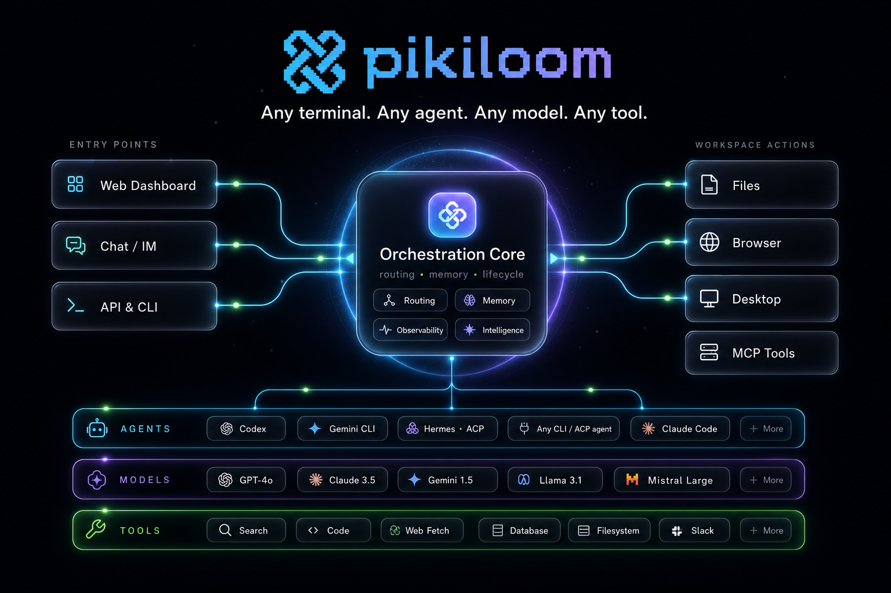
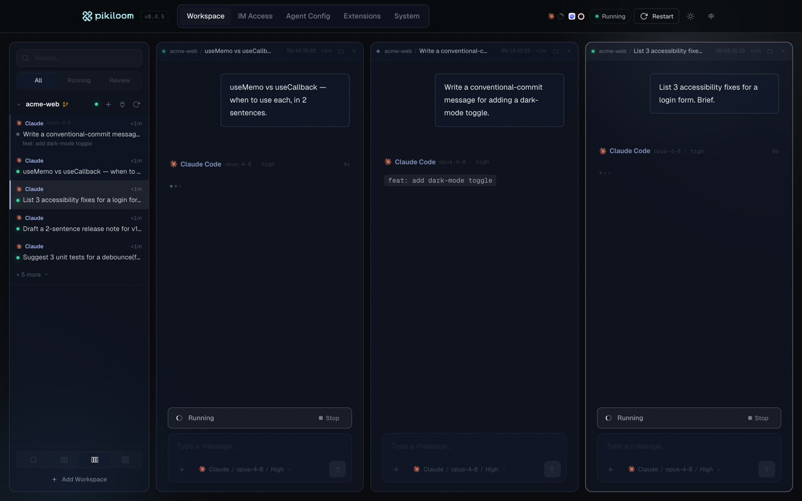
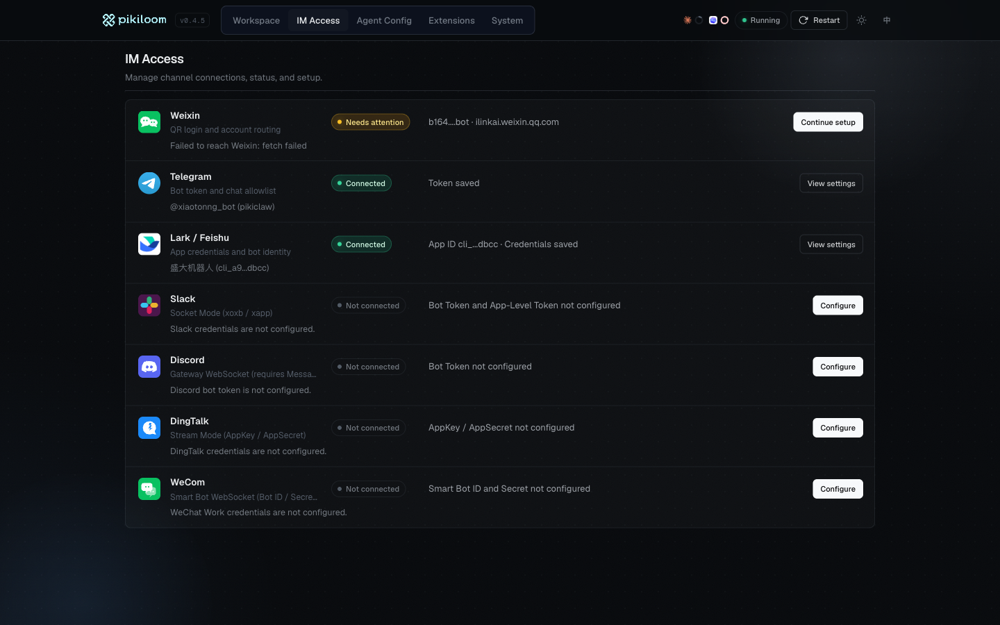
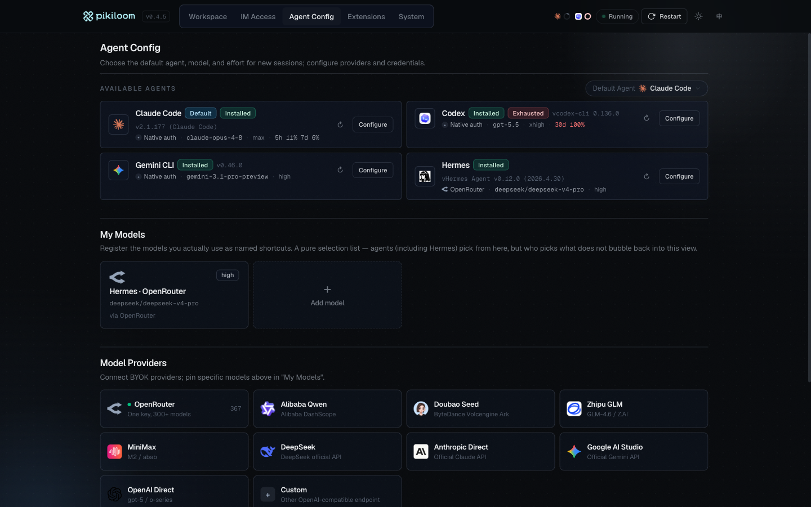
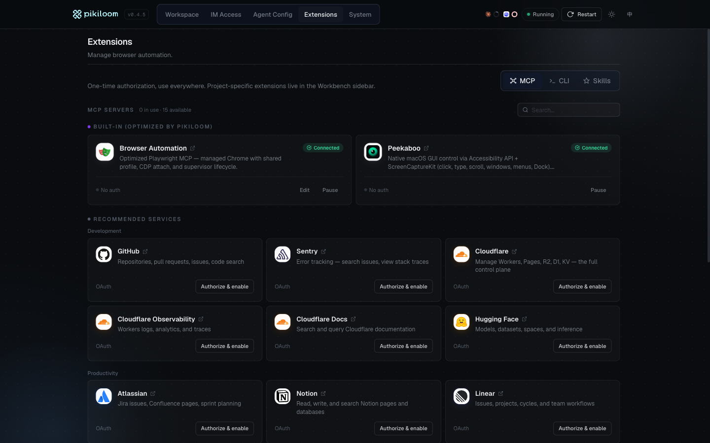
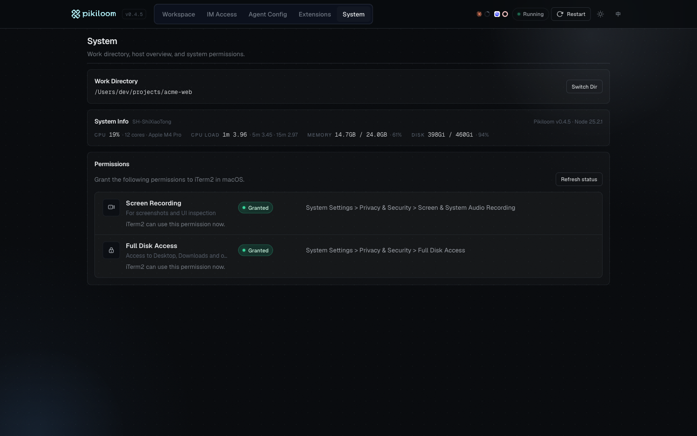

<div align="center">

# pikiclaw

## 把全世界最聪明的 AI Agent 装进你的口袋。

##### *面向「创作者不再需要看代码」时代的开放式 Agent 编排器。*

*接入任何 Agent（Claude · Codex · Gemini · Hermes · …），任何模型（Claude · GPT · Gemini · DeepSeek · 豆包 · MiMo · MiniMax · OpenRouter · 甚至是任意第三方代理），以及任何工具（Skills · MCP · CLI）。通过你最顺手的终端（IM、Web 或未来形态）来驱动它们。pikiclaw 本身就是用 pikiclaw 构建的。*

```bash
npx pikiclaw@latest
```

<p>
<a href="https://www.npmjs.com/package/pikiclaw"></a>
<a href="https://www.npmjs.com/package/pikiclaw"></a>
<a href="https://github.com/xiaotonng/pikiclaw/stargazers"></a>
<a href="LICENSE"></a>
<a href="https://nodejs.org"></a>
</p>

<p>
<a href="README.md">English</a> | <b>简体中文</b>
</p>



</div>

---

## pikiclaw 是什么？

**大多数「AI 开发工具」往往只做局部的创新 —— 绑定一款 IDE、单一 Agent 或某家模型厂商，然后便止步于此。** pikiclaw 则建立在一个截然不同的判断之上：下一代「创造」的过程，不会局限在某个单一的编辑器内部。它会发生在一个**编排器 (Orchestrator)** 中。在这里，创作者可以并发出一个 Agent **集群 (Swarm)**，让它们跑在当前最强大的模型上，并通过手边最方便的终端来掌控全局——而且，你甚至不需要打开任何代码文件。

核心产品就是这个编排器，其它所有组件都可拔插。**更酷的是，这个编排器是由它自己构建出来的** —— pikiclaw 就是我们用来开发 pikiclaw 的工具。

上面这张架构图勾勒出我们缝合在一起的四层结构：

- **入口层 (Entry Points)** —— Telegram、飞书、微信、Slack、Discord、钉钉、企业微信、Web Dashboard，以及本地 API / CLI，都是一等公民级别、地位完全对等的终端。新增任意一个新终端，对其它通道完全无感。
- **可插拔 Agent (Pluggable Agents)** —— Claude Code、Codex、Gemini、Hermes 均作为内置驱动。Hermes 走 ACP (Agent Client Protocol) 协议；任何 CLI 或 ACP 形态的 Agent 都可通过相同的 `AgentDriver` 契约接入注册表。
- **模型路由 (Model Routing)** —— 前沿系列（Claude · GPT · Gemini）、国产矩阵（DeepSeek · 豆包 · MiMo · MiniMax · Qwen）、本地推理（Ollama，以及 Apple Silicon 上的 mlx-lm）、OpenRouter，以及任意 OpenAI 兼容代理。Providers + Profiles 作为一等公民的凭据保险箱，自带只读的 `models.dev` 目录与启动时的逐 Agent 环境变量注入。
- **工具网 (Tool Mesh)** —— Skills、MCP 服务器、CLI 工具、Web Search、桌面自动化等，会在「全局 × 工作区」两个维度智能合并，并悄悄注入到每一次会话之中。

这一切的正中央，是 **Pikiclaw Orchestration Core** —— 由它来统一管理路由、记忆、可观测性和 Bot 生命周期，从而保证任何终端都能借助任意工具，让任意 Agent 跑在任意模型上。

---

## 自举：用自己构建自己

> 检验一个 Agent 编排器是否靠谱，最硬核的标准就是看它能不能自举（构建自己）。pikiclaw 做到了。我们日常使用 pikiclaw 来开发、测试、发布和运维 pikiclaw —— 覆盖了每一次 Commit 和每一次版本发布。

在 pikiclaw 里的典型开发日常是这样的：

- 窗口 1 里的 Claude Code 会话正在实现一个全新的 dashboard 路由。
- 窗口 2 里的 Codex 会话正在为它编写配套的单元测试，并在同一个工作区下运行。
- 窗口 3 里的 Gemini 会话在 Review Diff，并起草更新日志。
- 与此同时，第四条线程中的技能 (`/sk_promote`) 正在自动扫描 GitHub 的相关 Issue 并尝试回复。
- 这四个进程完全并行运作；而掌控它们的人，可能只是坐在咖啡馆里用一部手机进行统筹安排。

这个编排器就是产品本身，同时，它也恰好是我们用来构建它的 IDE。

---

## 默认并发集群 (Swarm)

大多数「AI 开发工具」的基本假设是：一个用户，一次只让一个 Agent 做一件事。pikiclaw 的假设则完全相反：**N 个 Agent，N 个窗口，一位指挥官，一套工具箱。**

- **N 路并行会话** —— Dashboard 上的每一个面板都是一条独立的 Agent 流，对应着一个独立的会话工作区；如果接入 IM，还能随时开辟出更多的工作线程。
- **Agent 随意混搭** —— 面板 1 跑 Claude Code，面板 2 跑 Codex，面板 3 跑 Gemini，它们可以在不同的代码仓库和工作区中各司其职。
- **统一的工具箱** —— 全局的 Skills、全局 MCP 服务器以及工作区专属的覆盖配置都会进行统一管理。只需配置一次，后续所有会话即可自动继承。
- **随时随地介入** —— 你可以随时打断运行中的数据流，将新指令插队，或者把控制权顺滑交接给下一个 Agent。
- **群组协作模式** —— 把编排器拉进飞书 / Slack / Discord / 企业微信的聊天群中，团队成员便能集体共享这同一个 Agent 集群。

这正是我们认为最关键的形态：让每个创作者的指尖，都掌控着一支全天候待命的 AI 军队。

---

## 实际演示

> **真实任务** —— 让 pikiclaw 收集并总结今天的 AI 新闻；Agent 自动阅读、撰写，最后通过 Telegram 将结果推送到你的手机上。

<p align="center"></p>

> **Web Dashboard** —— 多面板工作区，集成会话列表、实时对话流、工具调用轨迹、文件/图片附件、排队任务芯片以及统一的输入框（支持 1 / 2 / 3 / 6 面板布局、深浅色主题与中英双语 i18n）。

<p align="center"></p>

<details>
<summary><b>更多细节：基础操作 · IM 接入 · Agent 管理 · 模型配置 · 扩展工具 · 权限 · 系统信息</b></summary>

> 发送消息，观察 Agent 的流式输出，接收返回的文件附件。


> **IM 接入** —— Telegram、飞书、微信、Slack、Discord、钉钉、企业微信的频道连接状态与参数配置。



> **Agent 管理** —— 已安装的 Agent CLI 列表、默认 Agent 设定，以及各 Agent 独立的模型 / 推理强度配置；可绑定 Profile 让 Agent 跑在非原生模型上。



> **模型配置** —— 整合了 Provider + Profile 的凭据库（涵盖 Claude、GPT、Gemini、DeepSeek、豆包、MiMo、MiniMax、Qwen、OpenRouter 及任何 OpenAI 兼容代理），支持通过只读 `models.dev` 目录进行验证，并在 Agent 启动时定向注入对应环境变量；探测到 Ollama / mlx-lm（Apple Silicon）等本地后端时会自动挂载为 Provider。

> **扩展工具** —— 统一管理全局 MCP 服务器、社区版 Skills、内置托管的浏览器环境及 macOS 桌面（Peekaboo）自动化能力，支持通过 stdio、HTTP，或带动态客户端注册的 OAuth 2.1 接入服务。



> **系统权限** —— macOS 辅助功能、屏幕录制及磁盘访问权限管理。


> **系统信息** —— 当前工作目录详情，以及 CPU / 内存 / 磁盘使用率的全天候监控。



</details>

---

## 快速开始

**前置要求：** 环境须具备 Node.js 20+，并且在系统中至少登录过一款官方的 Agent CLI：

- [`claude`](https://docs.anthropic.com/en/docs/claude-code) (Claude Code)
- [`codex`](https://github.com/openai/codex) (Codex CLI)
- [`gemini`](https://github.com/google-gemini/gemini-cli) (Gemini CLI)
- `hermes` (Hermes —— 基于 ACP / Agent Client Protocol 协议)

**启动命令：**

```bash
cd your-workspace
npx pikiclaw@latest
```

这条命令会在 `http://localhost:3939` 自动唤起 **Web Dashboard**。随后，你就可以在浏览器里驱动任何会话、接入需要的 IM 渠道、灵活配置 Agent 和模型、快速安装 MCP 服务器与技能 (Skills)，并统筹所有的系统权限。其他一切功能，尽在一键之遥。

<details>
<summary><b>更喜欢传统的纯命令行配置？我们准备了专用的配置向导。</b></summary>

```bash
npx pikiclaw@latest --setup    # 开启交互式终端配置向导
npx pikiclaw@latest --doctor   # 仅检查并诊断当前环境
```

</details>

<details>
<summary><b>想跑在服务器上？官方支持 Docker。</b></summary>

```bash
docker run -d --name pikiclaw -p 3939:3939 \
  -e TELEGRAM_BOT_TOKEN=... \
  -e ANTHROPIC_API_KEY=sk-ant-... \
  -v pikiclaw-config:/home/piki/.pikiclaw \
  -v pikiclaw-workspace:/workspace \
  ghcr.io/xiaotonng/pikiclaw:latest
```

官方多架构镜像（`linux/amd64` + `linux/arm64`）已内置 `claude-code`、
`codex`、`gemini-cli`。仓库根目录提供了 `docker-compose.yml` 示例 ——
完整说明（鉴权方式、卷布局、反向代理 / TLS、固定 agent CLI 版本）
见 [docs/DOCKER.md](docs/DOCKER.md)。

</details>

---

## 典型的应用场景

- **并发运行集群** —— 在 Dashboard 里打开 N 个面板（或者开辟 N 个 IM 线程），每个面板运行不同的 Agent 负责不同的工作区，完全并行运作。一个人，多个 Agent，同一个全局驾驶舱。你可以随时强力介入任何一个工作流。
- **自包含的闭环开发** —— pikiclaw 就是用 pikiclaw 自己开发出来的。这套开发流本身就是这款产品最原始的面貌：甚至可以在外用手机操作编排器，让 Agent 写代码、发布版本并不断迭代。
- **挂机式编程 (Walk-away coding)** —— 发起一个耗时极长的大型重构任务，合上笔记本，外出时直接用手机通过 Telegram 进行监控和控制。Agent 始终在本地机器上运行，结果则会流式实时推回聊天界面中。
- **同工作区多 Agent 接力** —— 先让 Claude Code 写一版功能草稿，无缝切给 Codex 去做深度 Review，最后再交给 Gemini 提供截然不同视角的优化建议。所有这些操作都在同一份代码目录和相同的历史会话中完成。
- **灵活的国产 / 本地模型路由** —— 当你的任务对延迟、成本或合规有硬性要求时，通过模型注入层，可以让 Claude Code 直接跑在 DeepSeek、豆包、Qwen，甚至完全离线的 Ollama / mlx-lm 上。
- **群聊协作级 Agent** —— 把 pikiclaw 拉入飞书 / Slack / Discord / 企业微信群聊内；整个团队可以共享这同一个编排器、统一的项目工作区和一系列团队专属技能。
- **随手让 Codex 生图** —— 让 Codex 出张海报、出个示意图、画个 UI 草图，结果会作为真正的图片附件流回到聊天里，并附带一个可展开的「生图 Prompt」让你随时查看模型实际收到的指令。下一次迭代只需要继续聊，而不必再切回浏览器。
- **完全受控的 Computer-use 能力** —— 开启内置的 Chrome 浏览器托管（基于 Playwright）和 macOS 桌面环境托管（基于 Peekaboo，通过辅助功能和 ScreenCaptureKit）。Agent 瞬间获得「视力」(`see`)、可以自由点击、打字，并管理窗口、菜单栏和 Dock，而你依然可以通过手机远程精准操控它。无论是帮你预定一场会议、抓取某个数据面板信息、跑一通端到端自动测试，还是驱动任何原生的 macOS 本地应用，全都不在话下。
- **基于 Skill 体系的自动化工作流** —— 一次性安装好社区提供的常用技能（例如 `promote`、`snipe`、`review`、`security-review` 等），往后只需在任何连接的终端里输入 `/sk_<name>` 即可实现一键触发。

---

## 核心特性

### 终端层 (Terminal)

- **支持七大主流 IM** —— Telegram、飞书、微信（个人号）、Slack、Discord、钉钉与企业微信。开一个、开几个、全开都可以。底层每个渠道在代码上是物理隔离的；后续接入新通道（WhatsApp、自研移动 App、语音终端）也不会牵动其它通道。
- **Web Dashboard 面板** —— 直接在浏览器里驱动所有会话，对话流、工具调用轨迹和流式反馈都与 IM 完全一致。提供 1 / 2 / 3 / 6 面板布局、深浅色主题与中英双语 i18n。
- **实时流式预览** —— Agent 一边思考、消息一边原地更新；超长文本自动分段；思考过程、工具调用、Plan 都被分别折叠成卡片；图片与文件也会实时原样推回前端。
- **排队 / 操控统一在一个输入框** —— 上一条还在跑，你就能继续发；新消息以排队 chip 出现，可以预览、撤回，也可以让 Agent 立刻插队执行；一键即可同时停掉当前任务与所有排队任务。

### Agent 层

- **官方 CLI 作为原生底层驱动** —— 内置接入 Claude Code、Codex CLI、Gemini CLI 以及 Hermes（通过 ACP 协议）。我们坚决不自己「造一套套壳的 Agent 引擎」—— 上游核心一旦更新，你立刻就能享用。
- **原生拥抱 ACP 协议** —— Hermes 完全基于 [Agent Client Protocol](https://agentclientprotocol.com) 协议接入，通过 JSON-RPC stdio 唤起 `hermes acp`。未来任何兼容 ACP 的新 Agent 也能立刻无缝空降。
- **可插拔的驱动注册表** —— 整个代码库中唯一的契约只有 `src/agent/driver.ts`。无论是 CLI 还是 ACP 形态，新 Agent 都能落地，与四大内置引擎并肩。
- **会话级 Agent 切换** —— 不需要离开当前工作区，就能在会话中途给 AI 换一颗「大脑」，历史上下文继续生效。
- **接管与干预 (Steer)** —— 随时中断正在执行的重任务，让排队的紧急消息插到最前；或者一键停掉整个会话。
- **Codex 人机协同 (Human-in-the-loop)** —— Codex 需要确认操作时，提示会被自动转发到你的活跃终端（IM 或 Dashboard）。在原地回一句话，被暂停的任务就会继续。
- **持久化目标系统，按 Agent 路由** —— `/goal <objective>` 会让会话持续工作直到 Agent 自审满足条件。Codex 走原生 `thread/goal/*` RPC，可选 `budget=N` Token 预算并支持暂停 / 恢复；Claude 走原生 Stop hook + Haiku 评审，目标完成后自动清除；其它 Agent 走 pikiclaw 自带的可移植 continuation。
- **图片生成全链路接管** —— Codex 内置的 `image_gen`（以及 Claude MCP / Gemini Imagen）产出的图，会以真实的图片附件落到聊天里 —— 不再是一坨 base64。Agent 实际发给图模型的 `revised_prompt` 会作为可点开展开的「**生图 Prompt**」挂在图片旁；图片生成中时还会有「Generating image…」chip 在助手回复下闪烁，告诉你这一轮为什么慢。

### 模型层

- **前沿 + 国产 + 本地 + 各类代理** —— 前沿系列（Claude · GPT-5 / Codex · Gemini）、国产矩阵（DeepSeek · 豆包 · MiMo · MiniMax · Qwen）、本地推理（Ollama，以及 Apple Silicon 上的 mlx-lm）、OpenRouter，以及任意 OpenAI 兼容代理。
- **Providers & Profiles 凭据保险箱** —— API 凭据隔离存放在 `~/.pikiclaw/setting.json` 中。在只读的 `models.dev` 目录里浏览模型、通过真实的 Provider 探针验证密钥，再把 Profile 与某个 Agent 绑定，启动时自动注入对应环境变量。
- **本地模型零配置接入** —— 探测到 Ollama 或 mlx-lm 后端时会自动挂载为 Provider，不需要额外配置。Dashboard 上的卡片会展示状态、`brew/pipx` 安装命令、对应的 `ollama pull` / `mlx_lm.server` 拉模型命令，以及对照本机内存的 RAM 余量提示。
- **会话级模型 / 推理强度切换** —— 在 Dashboard、`/models` 或 `/mode` 中实时切换。推理强度按 Agent 提供（Claude：low → max；Codex：low → very high；Hermes：minimal → very high）。
- **Agent 级深度环境注入** —— `resolveAgentInjection(agentId)` 在启动时强制写入绑定 Profile 的环境变量。这意味着你可以让 Claude Code 全程跑在 DeepSeek、豆包，甚至本地 Ollama 上，而完全不动上游 CLI 的配置。

### 工具层

- **强大的技能系统 (Skills)** —— 项目专属技能存放在 `.pikiclaw/skills/*/SKILL.md` 中（也兼容旧的 `.claude/commands/*.md` 格式）。可以从 GitHub（`owner/repo`）一键安装社区包，或挑选我们精选的官方包（Anthropic Official、Vercel Agent Skills 等）。在任何终端里发 `/skills` 浏览，`/sk_<name>` 一键触发。
- **海量 MCP 生态加持** —— 浏览 [MCP Registry](https://registry.modelcontextprotocol.io)、手工增加 stdio / HTTP 服务、强制真实握手健康探测、支持带动态客户端注册的 OAuth 2.1。精选目录涵盖 GitHub、Atlassian、Notion、Linear、Sentry、Cloudflare、Slack、飞书/Lark、Stripe、Hugging Face、Gamma、Brave Search、Perplexity、Filesystem、SQLite 与 PostgreSQL —— 加上我们自带的两个 computer-use 服务：`pikiclaw-browser`（Playwright 驱动的 Chrome）与 `peekaboo`（Peekaboo 驱动的 macOS GUI）。
- **无缝接入主流 CLI 工具** —— 自动探测版本与登录态（gh、brew、npm、uv 等），OAuth-web 浏览器授权流程在 Agent 调用面上无缝衔接。
- **会话级 MCP 桥接** —— `im_list_files`、`im_send_file`、`im_ask_user`、`goal_get`、`goal_update` 等基础工具，加上启用后的浏览器与 macOS 桌面工具，会被自动注入到每一场会话里。
- **三层合并规则** —— 工具作用域永远遵循：`全局 (global) < 当前工作区 (workspace) < 内建 (built-in)`。引擎自动合并后无感生效。

### 运行环境与开发者体验 (Runtime & DX)

- **独立的会话工作区** —— 每一次会话都有专属的隔离目录；上传的文件以及 Agent 生成的产物（含图片）都会落在那里。
- **可恢复 / 可切换 / 自动分类** —— 多轮会话随意恢复与切换，自动按语义分类（answer / proposal / implementation / blocked），工作区会话列表按最近活动时间排序，覆盖所有已安装 Agent。
- **基础工具自动注入** —— `im_*`（列文件 / 发文件 / 问用户）与 `goal_*` 在每一条流里都默认可用 —— Agent 不需要任何配置就能把文件回推到你的 IM、或者卡在中途反过来问你一句。
- **Computer-use（浏览器层）** —— 内置的 `pikiclaw-browser` MCP 把 `@playwright/mcp` 包装上进程级 Supervisor 和一个共享的、隔离的 Chrome Profile。常用站点登录一次，所有后续任务都直接复用登录态。
- **Computer-use（macOS 桌面层）** —— 启用 `peekaboo` MCP（仅 macOS），即可调用 [Peekaboo](https://peekaboo.sh/) 提供的整套桌面控制工具：`see`、`click`、`type`、`scroll`、`window`、`menu`、`app`、`dock`，以及面向目标自主控制的 `agent` 子代理。需要在系统设置中授予终端「辅助功能」与「屏幕录制」权限。
- **为长任务硬化的运行时** —— 防休眠、看门狗、自动重启、守护进程模式、渠道 Supervisor 一应俱全；当还有任务在跑时主动阻止重启，保证你的马拉松作业不会被一次热加载弄崩。

---

## 到底有什么不同？

| | pikiclaw | IDE 级智能助手<br>(Cursor / Windsurf / Aider) | 云端 Agent<br>(Devin / 网页版 Claude) | 单体 IM 机器人 |
|---|---|---|---|---|
| **操作终端** | 7 大 IM + Web + 持续扩展 | 仅限 IDE 内部 | 局限在专属网页端 | 死绑在单个 IM 内的单个 Bot |
| **Agent 运行地** | 完全在你自己的本地机器上 | 你的本地机器 | 厂商分配的云端沙盒里 | 往往在厂商服务器端 |
| **Agent 的选择** | Claude Code · Codex · Gemini · Hermes (ACP) · …（任你选） | 深度绑定没得选 | 单一 | 单一 |
| **底层模型抉择** | 前沿 · 国产 · 本地（Ollama / mlx-lm）· OpenAI 兼容代理 | 平台控制 | 厂商绑定 | 单一无脑没得换 |
| **并发能力** | **N 个 Agent × N 个窗口 × N 个工作区** | 每个 IDE 窗口只能同时运行一个 | 串行排队 | 单一线程 |
| **文件与工具掌控** | 你主机上的所有本地文件、MCP 资源库、以及本地 CLI 系统 | 本地文件 | 沙盒受限环境 | 极度受限 |
| **接入新终端渠道** | 随便写个 `Channel` 基础实现类就能打通 | 无法实现 | 无法实现 | 需要 Fork 整个项目 |
| **接入新 Agent** | 实现一个简单的 `AgentDriver` 接口（CLI 或 ACP 均可）极速完成 | 无法实现 | 无法实现 | 需要 Fork 整个项目 |
| **能否自举开发** | **能！完全是由它自己一砖一瓦开发出来的！** | 不能 | 不能 | 不能 |

这个表格揭示了最核心的形态差异：**你不需要离开习惯的工作环境，你可以自由选择用哪颗「大脑」，你甚至可以并发操作一整支 AI 军队；而这个编排器本身，就是我们打造它的最佳工具。**

---

## 常用指令

| 指令 | 描述 |
|---|---|
| `/start` | 查看入口信息、当前 Agent 及工作目录 |
| `/sessions` | 查看、切换或新建会话 |
| `/agents` | 切换 Agent（Claude · Codex · Gemini · Hermes） |
| `/models` | 查看并切换当前会话的模型及推理强度 |
| `/mode` | 快捷切换计划模式 (推理强度) |
| `/switch` | 浏览并快速切换工作目录 |
| `/workspaces` | 从 Dashboard 收藏的快捷列表中选择工作区 |
| `/goal` | 设置或检视会话的长效目标（达成后 Agent 自动终止） |
| `/stop` | 强制停止当前会话 |
| `/status` | 检查运行状态、Token 消耗、资源使用及会话摘要 |
| `/host` | 监控主机的 CPU / 内存 / 磁盘 / 电池状态 |
| `/skills` | 浏览当前项目可用的所有技能 (Skills) |
| `/ext` | 快速查看扩展状态 |
| `/restart` | 重启并重新加载 Bot 服务 |
| `/sk_<name>` | 快速触发某个指定的项目技能 |

*注：不带斜杠的纯文本将作为普通消息直接发送给当前的 Agent。*

---

## 配置管理

- 核心持久化配置文件：`~/.pikiclaw/setting.json` —— 负责存储渠道、Agent、Providers/Profiles、工作区历史及 MCP 扩展等信息。
- Dashboard 是主要的配置入口；交互式的终端向导 (`--setup`) 与体检脚本 (`--doctor`) 主要为无 UI (headless) 环境准备。
- 全局 MCP 扩展配置存放于 `setting.json` 的 `extensions.mcp` 字段下。
- 工作区 MCP 扩展：遵循标准约定，存放于项目根目录的 `.mcp.json` 中。
- 项目专属技能：统一保存在 `.pikiclaw/skills/*/SKILL.md` 中（同时也兼容和加载 `.claude/commands/*.md` 格式）。

**Computer-use 的权限开关**需要在扩展面板独立控制：

- `browserEnabled` —— 开启后启用托管 Chrome（Playwright）。当 Agent 首次调用 Chrome 时，pikiclaw 会在 `~/.pikiclaw` 下生成专属配置文件，供后续会话跨任务复用。只需登录一次常用站点，今后即可免扫码直连。
- `peekabooEnabled` —— 开启后启用 macOS 桌面控制（Peekaboo）。该功能仅支持 macOS，开启后 pikiclaw 会拉起 `@steipete/peekaboo` 的 `peekaboo-mcp` 进程并挂载相关工具。*开启前，请务必前往 macOS 的「系统设置 → 隐私与安全性」，为启动 pikiclaw 的终端授予**辅助功能**和**屏幕录制**权限。*

---

## 产品路线图 (Roadmap)

- **SupporterAgent** —— 在现有「终端 × Agent × 模型 × 工具」编排栈之上再加一层 high-level 元代理，统一管理整个复杂任务的生命周期：从拆解与规划，到把合适的子 Agent 调度到合适的模型与工具上，再到全程盯着各路 stream，发现子 Agent 卡壳、走偏或与计划冲突时主动介入校正。目标是把 pikiclaw 在长时序、多 Agent 协作上的稳定性拉到新一档，让人不再需要逐轮盯着每个子任务。

---

## 本地开发

```bash
git clone https://github.com/xiaotonng/pikiclaw.git
cd pikiclaw
npm install
npm run build
npm test
```

```bash
npm run dev                       # 启动本地开发服务（--no-daemon，实时日志输出到 ~/.pikiclaw/dev/dev.log）
npm run build                     # 生产环境编译（Dashboard 构建 + tsc）
npm test                          # 运行 Vitest 测试套件
npx pikiclaw@latest --doctor      # 检测本机环境健康度
```

想要深度了解架构与集成细节，请参阅：[ARCHITECTURE.md](ARCHITECTURE.md) · [INTEGRATION.md](INTEGRATION.md) · [TESTING.md](TESTING.md)。

---

## 参与贡献

这个项目架构中的每一个分层，生来就是为了被**扩展**的。接入一个新终端、编写一个新 Agent、打造一款模型 Wrapper 或是增加实用的 MCP 工具 —— 这些全都是一等公民级别的贡献。

- 请先阅读 **[贡献指南](CONTRIBUTING.md)** 开始你的第一步。
- 欢迎关注贴有 [`good first issue`](https://github.com/xiaotonng/pikiclaw/labels/good%20first%20issue) 和 [`help wanted`](https://github.com/xiaotonng/pikiclaw/labels/help%20wanted) 标签的任务。
- 如果打算进行较大幅度的修改，请先提交 Issue 以便大家确认技术方案。

| 模块位置 | 你能拓展什么 |
|---|---|
| `src/agent/driver.ts`, `src/agent/drivers/*.ts`, `src/agent/acp-client.ts` | 增加一个新的 Agent Driver（基于 CLI 或是 ACP 协议） |
| `src/channels/base.ts`, `src/channels/*/` | 对接一个新的终端或 IM 渠道 |
| `src/model/`, `src/model/injector.ts` | 新增模型提供商，或者定制 Agent 环境的注入规则 |
| `src/dashboard/routes/*.ts` | 扩充 Dashboard 后端的 API 接口 |
| `src/agent/mcp/tools/*.ts`, `src/agent/mcp/bridge.ts` | 添加供单个会话专用的 MCP 工具 |
| `src/catalog/*.ts` | 向我们推荐优秀的 MCP Server、CLI 实用工具或优质技能仓库 |

---

## 交流与联系

有任何问题、建议，或想一起聊聊 Agent 编排，欢迎加作者微信：**18317014390**（添加时请备注 `pikiclaw`）。

---

## Star 历史趋势

<a href="https://www.star-history.com/#xiaotonng/pikiclaw&Date">
  
</a>

---

## 许可证

[MIT](LICENSE) —— 坚持开放构建。尽情使用、Fork 它，或者插入你自己开发的任意图层吧！
